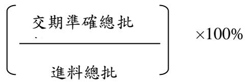
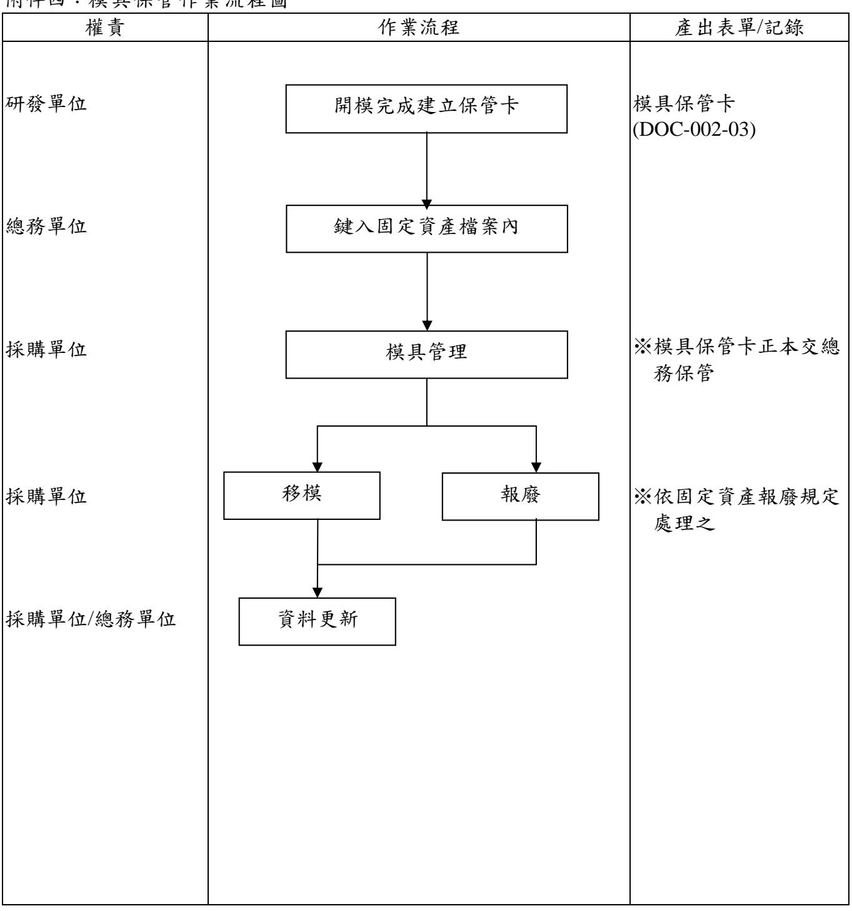

<table><tr><td rowspan=2 colspan=1>系統名稱</td><td rowspan=2 colspan=1>ISO 9001:2015</td><td rowspan=1 colspan=1>頁數</td><td rowspan=1 colspan=1>日期</td></tr><tr><td rowspan=1 colspan=1>第1頁，共17頁</td><td rowspan=1 colspan=1>2017/01/01</td></tr><tr><td rowspan=2 colspan=1>文件名稱</td><td rowspan=2 colspan=1>採購暨供應商評鑑作業程序</td><td rowspan=1 colspan=2>文件编號</td></tr><tr><td rowspan=1 colspan=2>DOC-002</td></tr></table>

<table><tr><td rowspan=1 colspan=6>文件核准與修改記錄</td></tr><tr><td rowspan=27 colspan=1>行</td><td rowspan=1 colspan=1>日期</td><td rowspan=1 colspan=3>修改内容</td><td rowspan=1 colspan=1>發文單位</td></tr><tr><td rowspan=1 colspan=1>2017/01/01</td><td rowspan=1 colspan=3>ISO 9001&amp;140012015新版條文要求更新内容符合法規</td><td rowspan=1 colspan=1>陳永勳</td></tr><tr><td rowspan=1 colspan=1></td><td rowspan=1 colspan=3></td><td rowspan=1 colspan=1></td></tr><tr><td rowspan=1 colspan=1></td><td rowspan=1 colspan=3></td><td rowspan=1 colspan=1></td></tr><tr><td rowspan=1 colspan=1></td><td rowspan=1 colspan=3></td><td rowspan=1 colspan=1></td></tr><tr><td rowspan=1 colspan=1></td><td rowspan=1 colspan=3></td><td rowspan=1 colspan=1></td></tr><tr><td rowspan=1 colspan=1></td><td rowspan=1 colspan=3></td><td rowspan=1 colspan=1></td></tr><tr><td rowspan=1 colspan=1></td><td rowspan=1 colspan=3></td><td rowspan=1 colspan=1></td></tr><tr><td rowspan=1 colspan=1></td><td rowspan=1 colspan=3></td><td rowspan=1 colspan=1></td></tr><tr><td rowspan=1 colspan=1></td><td rowspan=1 colspan=3></td><td rowspan=1 colspan=1></td></tr><tr><td rowspan=1 colspan=1></td><td rowspan=1 colspan=3></td><td rowspan=1 colspan=1></td></tr><tr><td rowspan=1 colspan=1></td><td rowspan=1 colspan=3></td><td rowspan=1 colspan=1></td></tr><tr><td rowspan=1 colspan=1></td><td rowspan=1 colspan=3></td><td rowspan=1 colspan=1></td></tr><tr><td rowspan=1 colspan=1></td><td rowspan=1 colspan=3></td><td rowspan=1 colspan=1></td></tr><tr><td rowspan=1 colspan=1></td><td rowspan=1 colspan=3></td><td rowspan=1 colspan=1></td></tr><tr><td rowspan=1 colspan=1></td><td rowspan=1 colspan=3></td><td rowspan=1 colspan=1></td></tr><tr><td rowspan=1 colspan=1></td><td rowspan=1 colspan=3></td><td rowspan=1 colspan=1></td></tr><tr><td rowspan=1 colspan=1></td><td rowspan=1 colspan=3></td><td rowspan=1 colspan=1></td></tr><tr><td rowspan=1 colspan=1></td><td rowspan=1 colspan=3></td><td rowspan=1 colspan=1></td></tr><tr><td rowspan=1 colspan=1></td><td rowspan=1 colspan=3></td><td rowspan=1 colspan=1></td></tr><tr><td rowspan=1 colspan=1></td><td rowspan=1 colspan=3></td><td rowspan=1 colspan=1></td></tr><tr><td rowspan=1 colspan=1></td><td rowspan=1 colspan=3></td><td rowspan=1 colspan=1></td></tr><tr><td rowspan=1 colspan=1></td><td rowspan=1 colspan=3></td><td rowspan=1 colspan=1></td></tr><tr><td rowspan=1 colspan=1></td><td rowspan=1 colspan=3></td><td rowspan=1 colspan=1></td></tr><tr><td rowspan=1 colspan=1></td><td rowspan=1 colspan=3></td><td rowspan=1 colspan=1></td></tr><tr><td rowspan=1 colspan=1></td><td rowspan=1 colspan=3></td><td rowspan=1 colspan=1></td></tr><tr><td rowspan=1 colspan=1></td><td rowspan=1 colspan=3></td><td rowspan=1 colspan=1></td></tr><tr><td rowspan=1 colspan=3>核准</td><td rowspan=1 colspan=1>審核</td><td rowspan=1 colspan=2>製訂</td></tr><tr><td rowspan=1 colspan=3>廖宜彥</td><td rowspan=1 colspan=1>陳永勳</td><td rowspan=1 colspan=2>詹張進</td></tr></table>

<table><tr><td rowspan=4 colspan=1>CIPHERLAB</td><td rowspan=2 colspan=1>系統名稱</td><td rowspan=2 colspan=1>ISO 9001:2015</td><td rowspan=1 colspan=1>頁數</td><td rowspan=1 colspan=1>日期</td></tr><tr><td rowspan=1 colspan=1>第2頁，共17頁</td><td rowspan=1 colspan=1>2017/01/01</td></tr><tr><td rowspan=2 colspan=1>文件名稱</td><td rowspan=2 colspan=1>採購暨供應商評鑑作業程序</td><td rowspan=1 colspan=2>文件编號</td></tr><tr><td rowspan=1 colspan=2>DOC-002</td></tr></table>

1.目的：

為確保採購之物料、組件與委外加工能以合理價格且適時、適質、適量提供公司所須，並在買賣雙方維持良好關係，特訂定本管制程序。

# 2.範圍：

適用於採購生產原物料、已完工模具設備、委外品皆屬之。

3.職責：

3.1 採購單位負責選擇優良之供應廠商並確保物料之供應及模具設備之管理。

3.2 品管單位負責供貨品質之品管作業。

3.3研發單位就廠商提供之環境限用物質樣品進行審查。

3.4 採購、資材、委外管理單位負責委外加工，選擇優良之委外廠商並確保委外品之供應無虞。

3.5 決定其所採購產品與服務之環境要求事項。

(例: 環保、省水、節能標章、低污染、可回收及重覆使用)。

# 4.執行程序：

4.1 作業流程圖：

4.1.1 採購/委外作業流程圖(一般物料/委外品)(附件一)  
4.1.2 供應商管理作業流程圖(附件二)  
4.1.3 樣品承認作業流程圖(附件三)  
4.1.4 模具保管作業流程圖(附件四)

4.2 採購目標：

4.2.1 選擇優良供應商確保料源。  
4.2.2 確保採購物品的品質。  
4.2.3 落實生產計劃催交物料作業，期能適時供應所須物品。  
4.2.4 防止採購作業異常發生，針對異常能迅速妥當處理。

4.3 供應商之開發與選用：

4.3.1 供應商開發時機：

4.3.1.1 現有供應商無法提供時。  
4.3.1.2 現有供應商在品質、成本或交期無法滿足需求時。  
4.3.1.3 次供應商(SECOND SOURCE)開發。

<table><tr><td rowspan=2 colspan=1>系統名稱</td><td rowspan=2 colspan=1>ISO 9001:2015</td><td rowspan=1 colspan=1>頁數</td><td rowspan=1 colspan=1>日期</td></tr><tr><td rowspan=1 colspan=1>第3頁，共17頁</td><td rowspan=1 colspan=1>2017/01/01</td></tr><tr><td rowspan=2 colspan=1>文件名稱</td><td rowspan=2 colspan=1>採購暨供應商評鑑作業程序</td><td rowspan=1 colspan=2>文件编號</td></tr><tr><td rowspan=1 colspan=2>DOC-002</td></tr></table>

4.3.1.4 現有供應商之原承認資格已被取消。

4.3.1.5 依合約中客戶指定。

4.3.2 供應商之選用原則

4.3.2.1 有足夠的開發、生產、品質管理能力。  
4.3.2.2 有健全的財務狀況。  
4.3.2.3 有誠意與本公司來往。  
4.3.2.4 有合理之市場競爭價格。  
4.3.2.5 依合約中客戶指定。

4.3.3 合格供應商之選用：

4.3.3.1 符合公司環境限用物質管理規範要求之供應商。

4.3.3.2 凡屬電子零件類之供應商，由採購單位參考供應商選用原則評估是否符合需求，經電話或訪談確認後，由採購單位將廠商基本資料鍵入系統廠商明細表內,並發起電子簽核流程。

4.3.3.3 凡屬機構件之供應商，先由採購單位就廠商基本資料作一過濾，選出符合之廠商，如須再進一步就廠商資格作確認時，可會同品管及研發等相關單位進行廠商評鑑，廠商評鑑結果須填入『供應商評鑑報告』(DOC-002-01)內，評鑑總分在 75 分以上者列入系統廠商明細表內。評鑑總分在 60-74 分者，由採購單位將評鑑缺點通知供應商改善，如供應商確認三個月內可作改善者，改善後再作一次評鑑以決定是否可列入供應商名錄內。59 分以下者年度內不得再要求評鑑。4.3.3.4 若通過 ISO 9000 或第三認證單位認證通過公司可以不需進行廠商評鑑作業。

4.4 供應商之考核：

4.4.1 考核對象為與本公司有往來之交貨合格供應商。

4.4.2 考核項目以交貨品質、交期準確率為依據。

4.4.3 考核頻率為每半年一次。

4.4.4 由品管單位針對交貨品質作考核，採購單位針對交期準確率考核。交貨品質佔整體考核分數之 $7 0 \%$ 、交期準確率佔整體考核分數之 $3 0 \%$ 。

4.4.5 半年累計交貨批 $< = 2 5$ 批者不予考核，評分等級一律列為 B 等。

4.4.6 品管單位針對交貨品質評分如下：4.4.6.1 適用於符合環境限用物質要求的供應商之考核。

<table><tr><td rowspan=2 colspan=1>系統名稱</td><td rowspan=2 colspan=1>ISO 9001:2015</td><td rowspan=1 colspan=1>頁數</td><td rowspan=1 colspan=1>日期</td></tr><tr><td rowspan=1 colspan=1>第4頁，共17頁</td><td rowspan=1 colspan=1>2017/01/01</td></tr><tr><td rowspan=2 colspan=1>文件名稱</td><td rowspan=2 colspan=1>採購暨供應商評鑑作業程序</td><td rowspan=1 colspan=2>文件编號</td></tr><tr><td rowspan=1 colspan=2>DOC-002</td></tr></table>

4.4.6.2 評分方式：

<table><tr><td>合格總批數</td><td>×100%</td></tr><tr><td>進料總批數</td></tr></table>

4.4.6.3 正常檢驗、減量檢驗、免驗批數之定義依進料檢驗作業程序。

4.4.7.1 交貨準確率評分方式：

4.4.8 將以上二項積分依其權數加總後，將其評分結果記錄於『供應商考核評分表 $\mathbb { J }$ (DOC-002-02)內。

4.4.9 評分等級：

評分 $\geqq$ $9 5 \%$ ------------- A 等 $9 5 \% >$ 評分 $\geqq$ $8 5 \%$ ------------- B 等 $8 5 \% >$ 評分≧ $7 5 \%$ ------------- C 等 $7 5 \% >$ 評分 ----- D 等

A 等:可申請列入免驗廠商物料清單，視狀況增加採購量。  
B 等:維持正常採購。  
C 等:將不給予新的機種開發採購。  
D 等:予以廠商輔導，連續二次考核未能提升等級者，將停止採購。

4.5 供應商資格取消：

4.5.1 供應商考核評等 D 等者，經連續二次輔導無效，將取消其供應商資格採購。

採購人員須將不合格之供應商之資料自廠商基本資料表申請停止交易，並不再向其採購; 若為獨占或寡占產品之供應商,則將持續輔導至改善為止。

4.5.2 已不符合原承認資格條件者。

4.6 採購原料、物料及委外加工生產之驗證：

4.6.1 樣品送樣原則(委外品除外)：

4.6.1.1 第一次使用之零件。  
4.6.1.2 次供應商(SECOND SOURCE)之開發。  
4.6.1.3 降低成本(COST DOWN)之零件。

<table><tr><td rowspan=2 colspan=1>系統名稱</td><td rowspan=2 colspan=1>ISO 9001:2015</td><td rowspan=1 colspan=1>頁數</td><td rowspan=1 colspan=1>日期</td></tr><tr><td rowspan=1 colspan=1>第5頁，共17頁</td><td rowspan=1 colspan=1>2017/01/01</td></tr><tr><td rowspan=2 colspan=1>文件名稱</td><td rowspan=2 colspan=1>採購暨供應商評鑑作業程序</td><td rowspan=1 colspan=2>文件编號</td></tr><tr><td rowspan=1 colspan=2>DOC-002</td></tr></table>

4.6.1.4 原承認樣品之材料、規格或製程及環境限用物質有所變更時。

4.6.2 委外加工：

首批由生技提供樣品、BOM 表及生產文件 SOP/SIP 於資材單位、委外管理單位，再由資材單位、委外管理單位將樣品與生產文件轉委外加工廠，且於首批生產時生技須至委外廠現場指導。

4.6.3 委外生產：

委外廠提供相關 BOM 表、承認書給委外管理單位，委外管理單位依樣品承認作業執行驗證承認。

4.7 樣品承認作業：

4.7.1 申請：新開發的零件，由研發處進行搜尋及樣品承認，並由廠商提供樣品至少 3 份及電子檔承認書，由研發單位申請專案文件簽核進行承認書的申請，並進行樣品承認審核與測試，若為舊料需要重送就由採購人員申請，連同樣品一起送交研發單位進行資料審核與測試。

4.7.2 PP 測試料件暫不需承認，MP 量產時，則需請研發補齊所有樣品承認書。

4.7.3 研發單位審查資料是否齊全、規格是否符合所須及完成測試後，如確認為合格者即可將承認書製作成正式文件，並呈權責主管簽核後送至文管中心登錄後發行至各相關單位。

4.7.4 若評估為不合格者，由採購將評估缺點通知供應商改善，如經供應商改善後可重新送樣。

4.8 樣品承認之取消：

4.8.1 供應商考核評等不合格，經輔導無效者。  
4.8.2 同一零件連續三批進料有重大不良者，且無有效之改善對策。  
4.8.3 原承認樣品之材料規格或製程有所變動時，並足以影響原樣品之品質者。  
4.8.4 供應商原承認資格已被取消。

4.9 原(物)料驗證之執行場所：

4.9.1 本公司進料檢驗(IQC)—本公司進料檢驗處。  
4.9.2 目前本公司尚無在廠商處驗證事宜。

4.10 採購作業：

4.10.1 一般物料採購依『請購單』(系統表單)開立『採購單』(系統表單)並確認廠商、料號、品名規格、數量、交期、單價及樣品承認書無誤後，分發至供應商。

<table><tr><td rowspan=2 colspan=1>系統名稱</td><td rowspan=2 colspan=1>ISO 9001:2015</td><td rowspan=1 colspan=1>頁數</td><td rowspan=1 colspan=1>日期</td></tr><tr><td rowspan=1 colspan=1>第6頁，共17頁</td><td rowspan=1 colspan=1>2017/01/01</td></tr><tr><td rowspan=2 colspan=1>文件名稱</td><td rowspan=2 colspan=1>採購暨供應商評鑑作業程序</td><td rowspan=1 colspan=2>文件编號</td></tr><tr><td rowspan=1 colspan=2>DOC-002</td></tr></table>

4.10.2 委外加工時須先至系統產生製令再轉開『委外採購單』並確認各項規格、數量、交期、單價無誤後再經權責主管核准後分發至委外加工廠。

4.10.3 採購之廠商須選擇符合資格之廠商及依考評等級採購之。

4.10.4 凡已開立『採購單』及『委外採購單』者，若有任何改變時，需在系統內發起『採購變更單』及『委外採購變更單』經確認及發出後,始可生效。

4.11 交期管理：

4.11.1 交貨依據：

4.11.1.1 供應商應依『採購單』或『委外採購單』準時交貨。4.11.1.2 交貨時必須有採購單號碼或委外採購單號碼為依據，收料人員依號碼查看交期是否已到。

4.11.2 跟催：

4.11.2.1 對於生產急用料，須由負責採購之單位適時與供應商聯絡，以掌握交期之正確性。  
4.11.2.2 負責採購之單位定期與生管單位檢討備料、缺料的狀況以作為跟催之依據。

4.11.3 交期變更：

4.11.3.1 因業務需求變化，負責採購之單位應盡速與供應商協調交期變更事宜，並將結果反映至生管單位及相關部門。  
4.11.3.2 供應商因故無法準時交貨時，負責採購之單位須儘速反映給生管單位，以作權宜措施之安排。

4.12 交貨品質管理：

4.12.1 QC 檢驗不合格，並經最後判定為退貨時，材料部份由採購通知廠商處理；委外加工、生產部份：成品、半成品由資材單位通知廠商處理。

4.13 模具保管：

4.13.1 為確保本公司所開立之模具能有效保管及運用，模具開模完成，廠商單位須填寫『模具保管卡』(DOC-002-03)，並將正本送至總務單位作為固定資產管理之一部份；另採購單位須負責日後模具之管理。如有模具移轉廠商時，應通告總務單位並將移模之資料登錄於系統固定資產模具保管卡內，以確實掌握模具之所在記錄。

4.14 客戶對廠商產品(原料、物料、代工品)之驗證：

4.14.1 若合約中有規定，本公司賦予客戶或客戶代表在廠商處，查驗廠商供應本公司生產品是否符合規定要求之權利。但該查驗之記錄不作為本公司品質有效管制之證明。

<table><tr><td rowspan=2 colspan=1>系統名稱</td><td rowspan=2 colspan=1>ISO 9001:2015</td><td rowspan=1 colspan=1>頁數</td><td rowspan=1 colspan=1>日期</td></tr><tr><td rowspan=1 colspan=1>第7頁，共17頁</td><td rowspan=1 colspan=1>2017/01/01</td></tr><tr><td rowspan=2 colspan=1>文件名稱</td><td rowspan=2 colspan=1>採購暨供應商評鑑作業程序</td><td rowspan=1 colspan=2>文件编號</td></tr><tr><td rowspan=1 colspan=2>DOC-002</td></tr></table>

5.記錄：

5.1本程序所產生之記錄其管理說明如下：

<table><tr><td rowspan=1 colspan=1>記錄名稱</td><td rowspan=1 colspan=1>文件编號</td><td rowspan=1 colspan=1>Media形式</td><td rowspan=1 colspan=1>保存地點</td><td rowspan=1 colspan=1>保存期限</td></tr><tr><td rowspan=1 colspan=1>供應商評鑑報告</td><td rowspan=1 colspan=1>DOC-002-01</td><td rowspan=1 colspan=1>手寫</td><td rowspan=1 colspan=1>採購單位</td><td rowspan=1 colspan=1>供應商資格取消後一年</td></tr><tr><td rowspan=1 colspan=1>供應商考核評分表</td><td rowspan=1 colspan=1>DOC-002-02</td><td rowspan=1 colspan=1>電子檔</td><td rowspan=1 colspan=1>QC單位</td><td rowspan=1 colspan=1>至少三年</td></tr><tr><td rowspan=1 colspan=1>請購單</td><td rowspan=1 colspan=1></td><td rowspan=1 colspan=1>系統表單</td><td rowspan=1 colspan=1>生管、委外管理單位</td><td rowspan=1 colspan=1>至少五年</td></tr><tr><td rowspan=1 colspan=1>採購單</td><td rowspan=1 colspan=1></td><td rowspan=1 colspan=1>系統表單</td><td rowspan=1 colspan=1>採購單位</td><td rowspan=1 colspan=1>至少五年</td></tr><tr><td rowspan=1 colspan=1>委外採購單</td><td rowspan=1 colspan=1></td><td rowspan=1 colspan=1>系統表單</td><td rowspan=1 colspan=1>採購丶委外管理單位</td><td rowspan=1 colspan=1>至少五年</td></tr><tr><td rowspan=1 colspan=1>模具保管卡</td><td rowspan=1 colspan=1>DOC-002-03</td><td rowspan=1 colspan=1>手寫</td><td rowspan=1 colspan=1>總務單位</td><td rowspan=1 colspan=1>模具消失後五年</td></tr></table>

6.附件/表單

6.1 採購/委外作業流程圖(一般物料/半成品&成品)(附件一)

6.2 供應商管理作業流程圖(附件二)  
6.3 樣品承認作業流程圖(附件三)  
6.4 模具保管作業流程圖(附件四)  
6.5 供應商評鑑報告(DOC-002-01)  
6.6 供應商考核評分表(DOC-002-02)  
6.7 模具保管卡(DOC-002-03)

<table><tr><td rowspan=2 colspan=1>系統名稱</td><td rowspan=2 colspan=1>ISO 9001:2015</td><td rowspan=1 colspan=1>頁數</td><td rowspan=1 colspan=1>日期</td></tr><tr><td rowspan=1 colspan=1>第8頁，共17頁</td><td rowspan=1 colspan=1>2017/01/01</td></tr><tr><td rowspan=2 colspan=1>文件名稱</td><td rowspan=2 colspan=1>採購暨供應商評鑑作業程序</td><td rowspan=1 colspan=2>文件编號</td></tr><tr><td rowspan=1 colspan=2>DOC-002</td></tr></table>

<table><tr><td colspan="5">附件一：採購/委外作業流程圖(一般物料/半成品&amp;成品) 產出表單/記錄</td></tr><tr><td>權責</td><td colspan="4">作業流程</td></tr><tr><td>生管/委外單位</td><td colspan="3"></td><td>人工請購單或 MRP 請購單</td></tr><tr><td rowspan="2">採購/委外單位</td><td colspan="3">1</td><td rowspan="2">採購單、委外採購單 ※須確認廠商、料</td></tr><tr><td colspan="3">採購</td></tr><tr><td></td><td colspan="3"></td><td rowspan="6">號`品名規格`數 量、交期丶單價及 樣品承認一覽表</td></tr><tr><td rowspan="2">製造處主管</td><td colspan="2">審查/核准</td></tr><tr><td colspan="2"></td></tr><tr><td>採購/委外單位</td><td>下單/發料</td><td></td></tr><tr><td rowspan="2">採購/委外單位</td><td colspan="2">1 料號/數量/交期變更</td></tr><tr><td colspan="2">否</td></tr><tr><td>倉管人員</td><td>是</td><td></td><td>1 收料</td></tr><tr><td>品管人員</td><td></td><td>↓ 進料檢驗</td><td></td></tr><tr><td colspan="2"></td><td colspan="3"></td></tr><tr><td colspan="1" rowspan="4">CIPHERLAB</td><td colspan="1" rowspan="2">系統名稱</td><td colspan="1" rowspan="2">ISO 9001:2015</td><td colspan="1" rowspan="1">頁數</td><td colspan="1" rowspan="1">日期</td></tr><tr><td colspan="1" rowspan="1">第9頁，共17頁</td><td colspan="1" rowspan="1">2017/01/01</td></tr><tr><td colspan="1" rowspan="2">文件名稱</td><td colspan="1" rowspan="2">採購暨供應商評鑑作業程序</td><td colspan="2" rowspan="1">文件编號</td></tr><tr><td colspan="2" rowspan="1">DOC-002</td></tr></table>

附件二：供應商管理作業流程圖  

<table><tr><td>權責</td><td colspan="3">作業流程</td><td>產出表單/記錄</td></tr><tr><td></td><td colspan="3"></td><td rowspan="7">※電子件依以下原則 4.有合理之市場競爭價格。 5.依合約中客户指定。 ※機構件及委外廠依需 要進行供應商評鑑報告</td></tr><tr><td>採購/委外管理單位丶 製造/研發丶品管</td><td></td><td>供應商評鑑/篩選</td><td>1有足狗的開、生産、品質管理能力 2.有健全的财務狀況。 3.有誠意與本公司來往。</td></tr><tr><td rowspan="10"></td><td></td><td>?</td><td></td></tr><tr><td></td><td>採購/委外管理單位彙整</td><td></td></tr><tr><td>符合資格</td><td>?</td><td>（已通過ISO或第三驗證 公司認證之供應商得不 在此限)</td></tr><tr><td rowspan="2">是</td><td colspan="2">否</td></tr><tr><td></td><td>(DOC-002-01) →</td></tr><tr><td>採購單位</td><td colspan="2">填入系統廠商明細</td></tr><tr><td></td><td>1</td><td></td></tr><tr><td>品管單位/採購單位</td><td>定期考核</td><td></td></tr><tr><td rowspan="8">採購單位</td><td colspan="2">1</td></tr><tr><td colspan="2">合格</td></tr><tr><td rowspan="3"></td><td>是 ? 否</td></tr><tr><td></td></tr><tr><td>1 填入合格供應商一覽表</td></tr><tr><td colspan="2">合格供應商一覽表</td></tr><tr><td colspan="2"></td></tr></table>

附件三：樣品承認作業流程圖  

<table><tr><td rowspan=4 colspan=1>CIPHERLAB</td><td rowspan=2 colspan=1>系統名稱</td><td rowspan=2 colspan=1>ISO 9001:2015</td><td rowspan=1 colspan=1>頁數</td><td rowspan=1 colspan=1>日期</td></tr><tr><td rowspan=1 colspan=1>第10頁,共17頁</td><td rowspan=1 colspan=1>2017/01/01</td></tr><tr><td rowspan=2 colspan=1>文件名稱</td><td rowspan=2 colspan=1>採購暨供應商評鑑作業程序</td><td rowspan=1 colspan=2>文件编號</td></tr><tr><td rowspan=1 colspan=2>DOC-002</td></tr></table>

附件四：模具保管作業流程圖  

<table><tr><td rowspan=2 colspan=1>系統名稱</td><td rowspan=2 colspan=1>ISO 9001:2015</td><td rowspan=1 colspan=1>頁數</td><td rowspan=1 colspan=1>日期</td></tr><tr><td rowspan=1 colspan=1>第11頁,共17頁</td><td rowspan=1 colspan=1>2017/01/01</td></tr><tr><td rowspan=2 colspan=1>文件名稱</td><td rowspan=2 colspan=1>採購暨供應商評鑑作業程序</td><td rowspan=1 colspan=2>文件编號</td></tr><tr><td rowspan=1 colspan=2>DOC-002</td></tr></table>

<table><tr><td rowspan=4 colspan=1>CIPHERLAB</td><td rowspan=2 colspan=1>系統名稱</td><td rowspan=2 colspan=1>ISO 9001:2015</td><td rowspan=1 colspan=1>頁數</td><td rowspan=1 colspan=1>日期</td></tr><tr><td rowspan=1 colspan=1>第12頁,共17頁</td><td rowspan=1 colspan=1>2017/01/01</td></tr><tr><td rowspan=2 colspan=1>文件名稱</td><td rowspan=2 colspan=1>採購暨供應商評鑑作業程序</td><td rowspan=1 colspan=2>文件编號</td></tr><tr><td rowspan=1 colspan=2>DOC-002</td></tr></table>

# 供應商評鑑報告

1.廠商名稱:

2.地 址:

3.電 話:

4.出席人員:

供應商代表：

本廠代表：姓名: 職務: 採購:姓名: 職務: 品管:姓名: 職務: 研發/製造:姓名: 職務: 委外:

5.主要產品或加工別:

6.認定產品或加工別:

7.評鑑結果:

工程技術: 分  
品質管理: 分  
環境管理: 合格 不合格  
價格交期: 分

合 計: 分分平均分數:

合格 列入合格供應商名錄不合格 可改善後再重新評鑑不合格 年度入內不得再要求評鑑

8.會簽及承認:

品管： 採購： 研發/製造： 委外：

<table><tr><td rowspan=4 colspan=1>CIPHERLAB</td><td rowspan=2 colspan=1>系統名稱</td><td rowspan=2 colspan=1>ISO 9001:2015</td><td rowspan=1 colspan=1>頁數</td><td rowspan=1 colspan=1>日期</td></tr><tr><td rowspan=1 colspan=1>第13頁,共17頁</td><td rowspan=1 colspan=1>2017/01/01</td></tr><tr><td rowspan=2 colspan=1>文件名稱</td><td rowspan=2 colspan=1>採購暨供應商評鑑作業程序</td><td rowspan=1 colspan=2>文件编號</td></tr><tr><td rowspan=1 colspan=2>DOC-002</td></tr></table>

1.評鑑項目: 開發及製程技術

2.評鑑單位: 製造、研發單位

3.評鑑內容:

<table><tr><td rowspan=1 colspan=1>品質管制評鑑内容</td><td rowspan=1 colspan=1>評鑑說明</td><td rowspan=1 colspan=1>配分</td><td rowspan=1 colspan=1>得分</td></tr><tr><td rowspan=1 colspan=1>1.開發設計組織之人員是否充足，職責是否分明。</td><td rowspan=1 colspan=1></td><td rowspan=1 colspan=1>10</td><td rowspan=1 colspan=1></td></tr><tr><td rowspan=1 colspan=1>2.工程人員有無專門技術能力。</td><td rowspan=1 colspan=1></td><td rowspan=1 colspan=1>10</td><td rowspan=1 colspan=1></td></tr><tr><td rowspan=1 colspan=1>3.有無治工具之製造及維修能力。</td><td rowspan=1 colspan=1></td><td rowspan=1 colspan=1>10</td><td rowspan=1 colspan=1></td></tr><tr><td rowspan=1 colspan=1>4.設計變更是否有管制。</td><td rowspan=1 colspan=1></td><td rowspan=1 colspan=1>10</td><td rowspan=1 colspan=1></td></tr><tr><td rowspan=1 colspan=1>5.製造現場是否符合作業環境要求。</td><td rowspan=1 colspan=1></td><td rowspan=1 colspan=1>10</td><td rowspan=1 colspan=1></td></tr><tr><td rowspan=1 colspan=1>6.有無標準作業說明書。</td><td rowspan=1 colspan=1></td><td rowspan=1 colspan=1>10</td><td rowspan=1 colspan=1></td></tr><tr><td rowspan=1 colspan=1>7.作業人員是否瞭解作業條件及規格要求。</td><td rowspan=1 colspan=1></td><td rowspan=1 colspan=1>10</td><td rowspan=1 colspan=1></td></tr><tr><td rowspan=1 colspan=1>8.製程規劃是否合理。</td><td rowspan=1 colspan=1></td><td rowspan=1 colspan=1>10</td><td rowspan=1 colspan=1></td></tr><tr><td rowspan=1 colspan=1>9.確認産品之生產設備:主要設備及相關設備是否充足。</td><td rowspan=1 colspan=1></td><td rowspan=1 colspan=1>10</td><td rowspan=1 colspan=1></td></tr><tr><td rowspan=1 colspan=1>10．生産及測試設備是否正常使用及維護。</td><td rowspan=1 colspan=1></td><td rowspan=1 colspan=1>10</td><td rowspan=1 colspan=1></td></tr><tr><td rowspan=1 colspan=2>總                                                         分</td><td rowspan=1 colspan=1>100</td><td rowspan=1 colspan=1></td></tr><tr><td rowspan=1 colspan=1>環境管制評鑑內容</td><td rowspan=1 colspan=1>評鑑說明</td><td rowspan=1 colspan=1>符合</td><td rowspan=1 colspan=1>不符合</td></tr><tr><td rowspan=1 colspan=1>有害物質管制能力(RoHS、WEEE、SVHC、REACH...等）。</td><td rowspan=1 colspan=1></td><td rowspan=1 colspan=1></td><td rowspan=1 colspan=1></td></tr><tr><td rowspan=1 colspan=4>最終判定:(品質管制評鑑結果:       ）(環境管制評鑑結果：      ）</td></tr></table>

評核人:

日期:

<table><tr><td rowspan=4 colspan=1>CIPHERLAB</td><td rowspan=2 colspan=1>系統名稱</td><td rowspan=2 colspan=1>ISO 9001:2015</td><td rowspan=1 colspan=1>頁數</td><td rowspan=1 colspan=1>日期</td></tr><tr><td rowspan=1 colspan=1>第14頁,共17頁</td><td rowspan=1 colspan=1>2017/01/01</td></tr><tr><td rowspan=2 colspan=1>文件名稱</td><td rowspan=2 colspan=1>採購暨供應商評鑑作業程序</td><td rowspan=1 colspan=2>文件编號</td></tr><tr><td rowspan=1 colspan=2>DOC-002</td></tr></table>

1.評鑑項目: 品質管理

2.評鑑單位: 品管

2. 評鑑內容:

<table><tr><td rowspan=1 colspan=1>品質管制評鑑內容</td><td rowspan=1 colspan=1>評鑑說明</td><td rowspan=1 colspan=1>配分</td><td rowspan=1 colspan=1>得分</td></tr><tr><td rowspan=1 colspan=1>1.品管組織是否健全(專任品管人員及專業能力）。</td><td rowspan=1 colspan=1></td><td rowspan=1 colspan=1>10</td><td rowspan=1 colspan=1></td></tr><tr><td rowspan=1 colspan=1>2.有無進料品質管制之功能。</td><td rowspan=1 colspan=1></td><td rowspan=1 colspan=1>10</td><td rowspan=1 colspan=1></td></tr><tr><td rowspan=1 colspan=1>3.製程上有無品質管制之功能。</td><td rowspan=1 colspan=1></td><td rowspan=1 colspan=1>10</td><td rowspan=1 colspan=1></td></tr><tr><td rowspan=1 colspan=1>4.有無出貨品管之功能，其採用之管制是否與本廠配合。</td><td rowspan=1 colspan=1></td><td rowspan=1 colspan=1>10</td><td rowspan=1 colspan=1></td></tr><tr><td rowspan=1 colspan=1>5.量具、儀器準確度是否可靠，是否有校驗記錄。</td><td rowspan=1 colspan=1></td><td rowspan=1 colspan=1>10</td><td rowspan=1 colspan=1></td></tr><tr><td rowspan=1 colspan=1>6.有無信賴保證之作業，信賴性試驗之設備是否完善。</td><td rowspan=1 colspan=1></td><td rowspan=1 colspan=1>10</td><td rowspan=1 colspan=1></td></tr><tr><td rowspan=1 colspan=1>7.檢驗測試人員是否受過相關訓練或具足夠能力。</td><td rowspan=1 colspan=1></td><td rowspan=1 colspan=1>10</td><td rowspan=1 colspan=1></td></tr><tr><td rowspan=1 colspan=1>8.當料品品質或作業條件異常時，是否有矯正措施。</td><td rowspan=1 colspan=1></td><td rowspan=1 colspan=1>10</td><td rowspan=1 colspan=1></td></tr><tr><td rowspan=1 colspan=1>9.是否有執行文件管制。</td><td rowspan=1 colspan=1></td><td rowspan=1 colspan=1>10</td><td rowspan=1 colspan=1></td></tr><tr><td rowspan=1 colspan=1>10．相關變更管制作業如何執行。</td><td rowspan=1 colspan=1></td><td rowspan=1 colspan=1>10</td><td rowspan=1 colspan=1></td></tr><tr><td rowspan=1 colspan=2>總                                                          分</td><td rowspan=1 colspan=1>100</td><td rowspan=1 colspan=1></td></tr><tr><td rowspan=1 colspan=1>環境管制評鑑內容</td><td rowspan=1 colspan=1>評鑑說明</td><td rowspan=1 colspan=1>符合</td><td rowspan=1 colspan=1>不符合</td></tr><tr><td rowspan=1 colspan=1>有害物質管制能力(RoHS、WEEE、SVHC、REACH...等）。</td><td rowspan=1 colspan=1></td><td rowspan=1 colspan=1></td><td rowspan=1 colspan=1></td></tr><tr><td rowspan=1 colspan=4>最終判定:(品質管制評鑑結果:       ）(環境管制評鑑結果：       ）</td></tr></table>

評核人:

<table><tr><td rowspan=4 colspan=1>CIPHERLAB</td><td rowspan=2 colspan=1>系統名稱</td><td rowspan=2 colspan=1>ISO 9001:2015</td><td rowspan=1 colspan=1>頁數</td><td rowspan=1 colspan=1>日期</td></tr><tr><td rowspan=1 colspan=1>第15頁,共17頁</td><td rowspan=1 colspan=1>2017/01/01</td></tr><tr><td rowspan=2 colspan=1>文件名稱</td><td rowspan=2 colspan=1>採購暨供應商評鑑作業程序</td><td rowspan=1 colspan=2>文件编號</td></tr><tr><td rowspan=1 colspan=2>DOC-002</td></tr></table>

# DOC-002-01

1.評鑑項目: 價格，交期及經營管理

2.評鑑單位: 採購、委外管理單位

3. 評鑑內容:

<table><tr><td rowspan=1 colspan=1>品質管制評鑑内容</td><td rowspan=1 colspan=1>評鑑說明</td><td rowspan=1 colspan=1>配分</td><td rowspan=1 colspan=1>得分</td></tr><tr><td rowspan=1 colspan=1>1．交期是否乎本廠要求            天。</td><td rowspan=1 colspan=1></td><td rowspan=1 colspan=1>10</td><td rowspan=1 colspan=1></td></tr><tr><td rowspan=1 colspan=1>2．價格水準是否合理及具競爭力。</td><td rowspan=1 colspan=1></td><td rowspan=1 colspan=1>10</td><td rowspan=1 colspan=1></td></tr><tr><td rowspan=1 colspan=1>3．有無與本廠類似或以上等級之客戶。</td><td rowspan=1 colspan=1></td><td rowspan=1 colspan=1>10</td><td rowspan=1 colspan=1></td></tr><tr><td rowspan=1 colspan=1>4．廠商之産能是否合乎本廠要求。</td><td rowspan=1 colspan=1></td><td rowspan=1 colspan=1>10</td><td rowspan=1 colspan=1></td></tr><tr><td rowspan=1 colspan=1>5．有無生產管制計劃及功能。</td><td rowspan=1 colspan=1></td><td rowspan=1 colspan=1>10</td><td rowspan=1 colspan=1></td></tr><tr><td rowspan=1 colspan=1>6．有無售後服務及抱怨處理。</td><td rowspan=1 colspan=1></td><td rowspan=1 colspan=1>10</td><td rowspan=1 colspan=1></td></tr><tr><td rowspan=1 colspan=1>7．緊急訂單之調整能力是否足夠。</td><td rowspan=1 colspan=1></td><td rowspan=1 colspan=1>10</td><td rowspan=1 colspan=1></td></tr><tr><td rowspan=1 colspan=1>8．業務及生管的協調聯繫能力是否足狗。</td><td rowspan=1 colspan=1></td><td rowspan=1 colspan=1>10</td><td rowspan=1 colspan=1></td></tr><tr><td rowspan=1 colspan=1>9．倉儲空間是否足夠規劃及管理是否合適。</td><td rowspan=1 colspan=1></td><td rowspan=1 colspan=1>10</td><td rowspan=1 colspan=1></td></tr><tr><td rowspan=1 colspan=1>10.停產前通知時間約幾 天</td><td rowspan=1 colspan=1></td><td rowspan=1 colspan=1>10</td><td rowspan=1 colspan=1></td></tr><tr><td rowspan=1 colspan=2>總                                                          分</td><td rowspan=1 colspan=1>100</td><td rowspan=1 colspan=1></td></tr><tr><td rowspan=1 colspan=1>環境管制評鑑內容</td><td rowspan=1 colspan=1>評鑑說明</td><td rowspan=1 colspan=1>符合</td><td rowspan=1 colspan=1>不符合</td></tr><tr><td rowspan=1 colspan=1>有害物質管制能力(RoHS、WEEE、SVHC、REACH...等）。</td><td rowspan=1 colspan=1></td><td rowspan=1 colspan=1></td><td rowspan=1 colspan=1></td></tr><tr><td rowspan=1 colspan=4>最終判定:(品質管制評鑑結果：       ）(環境管制評鑑結果：      ）</td></tr></table>

評核人:

日期:

<table><tr><td rowspan=4 colspan=1>CIPHERLAB</td><td rowspan=2 colspan=1>系統名稱</td><td rowspan=2 colspan=1>ISO 9001:2015</td><td rowspan=1 colspan=1>頁數</td><td rowspan=1 colspan=1>日期</td></tr><tr><td rowspan=1 colspan=1>第16頁,共17頁</td><td rowspan=1 colspan=1>2017/01/01</td></tr><tr><td rowspan=2 colspan=1>文件名稱</td><td rowspan=2 colspan=1>採購暨供應商評鑑作業程序</td><td rowspan=1 colspan=2>文件编號</td></tr><tr><td rowspan=1 colspan=2>DOC-002</td></tr></table>

# DOC-002-02

# 供 應 商 考 核 評 分 表

年 月 日

<table><tr><td rowspan=1 colspan=6>□</td></tr><tr><td rowspan=1 colspan=1>廠商名稱</td><td rowspan=1 colspan=1>交貨品質(70%)</td><td rowspan=1 colspan=1>交期準確率(30%)</td><td rowspan=1 colspan=1>總分</td><td rowspan=1 colspan=1>等級</td><td rowspan=1 colspan=1>備注</td></tr><tr><td rowspan=1 colspan=1></td><td rowspan=1 colspan=1></td><td rowspan=1 colspan=1></td><td rowspan=1 colspan=1></td><td rowspan=1 colspan=1></td><td rowspan=1 colspan=1></td></tr><tr><td rowspan=1 colspan=1></td><td rowspan=1 colspan=1></td><td rowspan=1 colspan=1></td><td rowspan=1 colspan=1></td><td rowspan=1 colspan=1></td><td rowspan=1 colspan=1></td></tr><tr><td rowspan=1 colspan=1></td><td rowspan=1 colspan=1></td><td rowspan=1 colspan=1></td><td rowspan=1 colspan=1></td><td rowspan=1 colspan=1></td><td rowspan=1 colspan=1></td></tr><tr><td rowspan=1 colspan=1></td><td rowspan=1 colspan=1></td><td rowspan=1 colspan=1></td><td rowspan=1 colspan=1></td><td rowspan=1 colspan=1></td><td rowspan=1 colspan=1></td></tr><tr><td rowspan=1 colspan=1></td><td rowspan=1 colspan=1></td><td rowspan=1 colspan=1></td><td rowspan=1 colspan=1></td><td rowspan=1 colspan=1></td><td rowspan=1 colspan=1></td></tr><tr><td rowspan=1 colspan=1></td><td rowspan=1 colspan=1></td><td rowspan=1 colspan=1></td><td rowspan=1 colspan=1></td><td rowspan=1 colspan=1></td><td rowspan=1 colspan=1></td></tr><tr><td rowspan=1 colspan=1></td><td rowspan=1 colspan=1></td><td rowspan=1 colspan=1></td><td rowspan=1 colspan=1></td><td rowspan=1 colspan=1></td><td rowspan=1 colspan=1></td></tr><tr><td rowspan=1 colspan=1></td><td rowspan=1 colspan=1></td><td rowspan=1 colspan=1></td><td rowspan=1 colspan=1></td><td rowspan=1 colspan=1></td><td rowspan=1 colspan=1></td></tr><tr><td rowspan=1 colspan=1></td><td rowspan=1 colspan=1></td><td rowspan=1 colspan=1></td><td rowspan=1 colspan=1></td><td rowspan=1 colspan=1></td><td rowspan=1 colspan=1></td></tr><tr><td rowspan=1 colspan=1></td><td rowspan=1 colspan=1></td><td rowspan=1 colspan=1></td><td rowspan=1 colspan=1></td><td rowspan=1 colspan=1></td><td rowspan=1 colspan=1></td></tr><tr><td rowspan=1 colspan=1></td><td rowspan=1 colspan=1></td><td rowspan=1 colspan=1></td><td rowspan=1 colspan=1></td><td rowspan=1 colspan=1></td><td rowspan=1 colspan=1></td></tr><tr><td rowspan=1 colspan=1></td><td rowspan=1 colspan=1></td><td rowspan=1 colspan=1></td><td rowspan=1 colspan=1></td><td rowspan=1 colspan=1></td><td rowspan=1 colspan=1></td></tr><tr><td rowspan=1 colspan=1></td><td rowspan=1 colspan=1></td><td rowspan=1 colspan=1></td><td rowspan=1 colspan=1></td><td rowspan=1 colspan=1></td><td rowspan=1 colspan=1></td></tr><tr><td rowspan=1 colspan=1></td><td rowspan=1 colspan=1></td><td rowspan=1 colspan=1></td><td rowspan=1 colspan=1></td><td rowspan=1 colspan=1></td><td rowspan=1 colspan=1></td></tr><tr><td rowspan=1 colspan=1></td><td rowspan=1 colspan=1></td><td rowspan=1 colspan=1></td><td rowspan=1 colspan=1></td><td rowspan=1 colspan=1></td><td rowspan=1 colspan=1></td></tr><tr><td rowspan=1 colspan=1></td><td rowspan=1 colspan=1></td><td rowspan=1 colspan=1></td><td rowspan=1 colspan=1></td><td rowspan=1 colspan=1></td><td rowspan=1 colspan=1></td></tr><tr><td rowspan=1 colspan=1></td><td rowspan=1 colspan=1></td><td rowspan=1 colspan=1></td><td rowspan=1 colspan=1></td><td rowspan=1 colspan=1></td><td rowspan=1 colspan=1></td></tr><tr><td rowspan=1 colspan=1></td><td rowspan=1 colspan=1></td><td rowspan=1 colspan=1></td><td rowspan=1 colspan=1></td><td rowspan=1 colspan=1></td><td rowspan=1 colspan=1></td></tr><tr><td rowspan=1 colspan=1></td><td rowspan=1 colspan=1></td><td rowspan=1 colspan=1></td><td rowspan=1 colspan=1></td><td rowspan=1 colspan=1></td><td rowspan=1 colspan=1></td></tr><tr><td rowspan=1 colspan=1></td><td rowspan=1 colspan=1></td><td rowspan=1 colspan=1></td><td rowspan=1 colspan=1></td><td rowspan=1 colspan=1></td><td rowspan=1 colspan=1></td></tr><tr><td rowspan=1 colspan=1></td><td rowspan=1 colspan=1></td><td rowspan=1 colspan=1></td><td rowspan=1 colspan=1></td><td rowspan=1 colspan=1></td><td rowspan=1 colspan=1></td></tr><tr><td rowspan=1 colspan=1></td><td rowspan=1 colspan=1></td><td rowspan=1 colspan=1></td><td rowspan=1 colspan=1></td><td rowspan=1 colspan=1></td><td rowspan=1 colspan=1></td></tr><tr><td rowspan=1 colspan=1></td><td rowspan=1 colspan=1></td><td rowspan=1 colspan=1></td><td rowspan=1 colspan=1></td><td rowspan=1 colspan=1></td><td rowspan=1 colspan=1></td></tr><tr><td rowspan=1 colspan=1></td><td rowspan=1 colspan=1></td><td rowspan=1 colspan=1></td><td rowspan=1 colspan=1></td><td rowspan=1 colspan=1></td><td rowspan=1 colspan=1></td></tr><tr><td rowspan=1 colspan=1></td><td rowspan=1 colspan=1></td><td rowspan=1 colspan=1></td><td rowspan=1 colspan=1></td><td rowspan=1 colspan=1></td><td rowspan=1 colspan=1></td></tr><tr><td rowspan=1 colspan=1></td><td rowspan=1 colspan=1></td><td rowspan=1 colspan=1></td><td rowspan=1 colspan=1></td><td rowspan=1 colspan=1></td><td rowspan=1 colspan=1></td></tr><tr><td rowspan=1 colspan=1></td><td rowspan=1 colspan=1></td><td rowspan=1 colspan=1></td><td rowspan=1 colspan=1></td><td rowspan=1 colspan=1></td><td rowspan=1 colspan=1></td></tr></table>

模具保管卡  

<table><tr><td rowspan=4 colspan=1>CIPHERLAB</td><td rowspan=2 colspan=1>系統名稱</td><td rowspan=2 colspan=1>ISO 9001:2015</td><td rowspan=1 colspan=1>頁數</td><td rowspan=1 colspan=1>日期</td></tr><tr><td rowspan=1 colspan=1>第17頁,共17頁</td><td rowspan=1 colspan=1>2017/01/01</td></tr><tr><td rowspan=2 colspan=1>文件名稱</td><td rowspan=2 colspan=1>採購暨供應商評鑑作業程序</td><td rowspan=1 colspan=2>文件编號</td></tr><tr><td rowspan=1 colspan=2>DOC-002</td></tr></table>

DOC-002-03

廠商編號： 年 月 日

卡號：  

<table><tr><td rowspan=1 colspan=8>下號·                                        廠商编號·                               年       月   □</td></tr><tr><td rowspan=5 colspan=1>模具資料</td><td rowspan=2 colspan=2>機型</td><td rowspan=2 colspan=1></td><td rowspan=2 colspan=1>模具型式</td><td rowspan=2 colspan=1></td><td rowspan=2 colspan=1>射出口壓鑄沖壓□其他</td><td rowspan=1 colspan=1>材質</td></tr><tr><td rowspan=1 colspan=1></td></tr><tr><td rowspan=1 colspan=2>名稱</td><td rowspan=1 colspan=1></td><td rowspan=1 colspan=1>穴數沖壓型式</td><td rowspan=1 colspan=1></td><td rowspan=1 colspan=1>模具費用</td><td rowspan=1 colspan=1></td></tr><tr><td rowspan=1 colspan=2>料號</td><td rowspan=1 colspan=1></td><td rowspan=1 colspan=1>模具尺寸長/寬/高</td><td rowspan=1 colspan=1></td><td rowspan=1 colspan=1>模貝壽命保證模次</td><td rowspan=1 colspan=1></td></tr><tr><td rowspan=1 colspan=2>圖號</td><td rowspan=1 colspan=1></td><td rowspan=1 colspan=1>重量</td><td rowspan=1 colspan=1></td><td rowspan=1 colspan=1>設計者</td><td rowspan=1 colspan=1></td></tr><tr><td rowspan=3 colspan=1>中药</td><td rowspan=1 colspan=2>廠商</td><td rowspan=1 colspan=3></td><td rowspan=1 colspan=1>負責人</td><td rowspan=1 colspan=1></td></tr><tr><td rowspan=1 colspan=2>地址</td><td rowspan=1 colspan=3></td><td rowspan=1 colspan=1>聯絡人</td><td rowspan=1 colspan=1></td></tr><tr><td rowspan=1 colspan=2>電话</td><td rowspan=1 colspan=1></td><td rowspan=1 colspan=1>傳真</td><td rowspan=1 colspan=1></td><td rowspan=1 colspan=1>統一编號</td><td rowspan=1 colspan=1></td></tr><tr><td rowspan=5 colspan=1>）中商(</td><td rowspan=1 colspan=2>廠商</td><td rowspan=1 colspan=3></td><td rowspan=1 colspan=2>加工廠商確認簽收</td></tr><tr><td rowspan=1 colspan=2>编號</td><td rowspan=1 colspan=1></td><td rowspan=1 colspan=1>負責人</td><td rowspan=1 colspan=1></td><td rowspan=4 colspan=2></td></tr><tr><td rowspan=1 colspan=2>地址</td><td rowspan=1 colspan=3></td></tr><tr><td rowspan=1 colspan=2>聯絡人</td><td rowspan=1 colspan=1></td><td rowspan=1 colspan=1>電话</td><td rowspan=1 colspan=1></td></tr><tr><td rowspan=1 colspan=2>統一編號</td><td rowspan=1 colspan=1></td><td rowspan=1 colspan=1>傳真</td><td rowspan=1 colspan=1></td></tr><tr><td rowspan=1 colspan=1>G</td><td rowspan=1 colspan=7>1.保管廠商需無條件妥善保管此模具。2.保管廠不再承製本公司之產品，須無條件完整退還本公司模具。3.保管廠商因保管或使用不當而造成模具損壞者，須無條件照兩倍賠償。4.保管廠商未經本公司同意，不得將模具移轉他人代工。5.保管廠商不得擅自利用本公司模具生產供應他人。</td></tr><tr><td rowspan=6 colspan=1>G</td><td rowspan=1 colspan=1>日期</td><td rowspan=1 colspan=5>整修内 容</td><td rowspan=1 colspan=1></td></tr><tr><td rowspan=1 colspan=1></td><td rowspan=1 colspan=5></td><td rowspan=1 colspan=1></td></tr><tr><td rowspan=1 colspan=1></td><td rowspan=1 colspan=5></td><td rowspan=1 colspan=1></td></tr><tr><td rowspan=1 colspan=1></td><td rowspan=1 colspan=5></td><td rowspan=1 colspan=1></td></tr><tr><td rowspan=1 colspan=1></td><td rowspan=1 colspan=5></td><td rowspan=1 colspan=1></td></tr><tr><td rowspan=1 colspan=1></td><td rowspan=1 colspan=5></td><td rowspan=1 colspan=1></td></tr></table>

註1：本保管卡背面請貼上該模具之照片(公、母模面、成品含料頭、)並註明機種別及日期註2：請於背面貼上照片或附照片檔